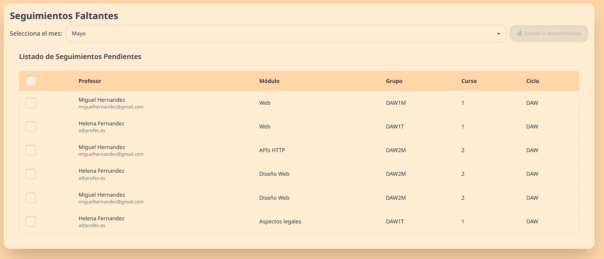
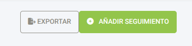

# Sistema de Seguimientos Docentes: Manual de Administración

## Introducción

Este sistema permite gestionar el seguimiento docente en un centro educativo. Facilita el control del avance académico, permitiendo a los jefes de departamento y administradores supervisar el cumplimiento de las programaciones didácticas.

## Envío de Recordatorios de Seguimientos

Esta sección explica el funcionamiento del sistema de envío de recordatorios para los seguimientos de docencia que aún no han sido completados por los profesores. Usted podrá seleccionar un mes específico y enviar correos electrónicos de recordatorio a los profesores correspondientes.

### Acceso

Tendrá que [acceder](Profesor.md#acceso) con una cuenta administrativa a la dirección del sistema proporcionada por tu institución. Una vez iniciada la sesión haga clic en el botón "Recordatorios" con un icono de sobre (✉️) en la parte superior izquierda de la pantalla.

### Flujo de Trabajo

1.  **Selección del Mes:** Utilice el selector de mes ubicado en la parte superior para filtrar los seguimientos pendientes correspondientes al mes deseado. Al cambiar el mes, la lista de seguimientos pendientes se actualizará automáticamente.

2.  **Listado de Seguimientos Pendientes:** Se mostrará una tabla con los seguimientos de docencia que aún no han sido realizados para el mes seleccionado. La tabla incluye información relevante como el nombre del profesor, su correo electrónico, el módulo, el grupo, el curso y el ciclo formativo asociado.

3.  **Selección de Profesores:** Usted puede seleccionar individualmente a los profesores a los que desea enviar un recordatorio marcando la casilla de verificación que se encuentra en la primera columna de cada fila. También tiene la opción de seleccionar todos los profesores activos de la lista utilizando la casilla de verificación ubicada en la cabecera de la tabla. Los profesores inactivos aparecerán deshabilitados y no podrán ser seleccionados para el envío de recordatorios.

4.  **Envío de Recordatorios:** Una vez que haya seleccionado a los profesores deseados, haga clic en el botón "Enviar [Número] recordatorios". El número que aparece en el botón se actualizará dinámicamente según la cantidad de profesores que haya seleccionado.

5.  **Confirmación y Errores:**
    - **Éxito:** Si el envío de los correos electrónicos de recordatorio se realiza correctamente, aparecerá un mensaje de confirmación en la parte superior de la pantalla indicando el número de correos electrónicos que han sido enviados, deberían aparecer tantos como profesores distintos ha seleccionado.
    - **Error:** Si ocurre algún error durante el proceso de envío, se mostrará un mensaje de error en la parte superior de la pantalla indicando la naturaleza del problema.

### Consideraciones Importantes

- El sistema solo mostrará los seguimientos pendientes de profesores que estén marcados como "activos" en el sistema.
- Los profesores inactivos no podrán ser seleccionados para el envío de recordatorios.
- Asegúrese de seleccionar el mes correcto antes de enviar los recordatorios.
- Verifique la lista de profesores seleccionados antes de proceder con el envío.

## Acceso a la interfaz administrativa

Puede acceder a la interfaz administrativa a través de la aplicación web, dándole al botón de ajustes, icono de engranaje (⚙️) en la parte superior izquierda de la pantalla, o directamente mediante el enlace de administración proveído por su institución.

1. Iniciar sesión con un usuario que tenga permisos de administrador
2. La interfaz mostrará el panel "Administración de Seguimientos" con todas las secciones disponibles

## Gestión de años académicos

### Crear año académico

> Si ya existen años académicos es recomendia clonar el anterior [cómo se indica aquí](#clonar-año-académico)

1. Ir a "Años Académicos" en el panel de administración
2. Hacer clic en "Añadir Año Académico"
3. Introducir el año académico en formato "XXXX-YY" (ej. "2023-24")
4. Marcar "Actual" si es el año académico en curso
5. Guardar los cambios

### Clonar año académico

Esta función permite copiar la estructura de un año académico previo:

1. En la lista de años académicos, localice el botón "Clonar" junto al año que desea replicar
2. Seleccione una de las opciones:
   - **Ciclos**: Solo clona la estructura de ciclos formativos
   - **Módulos**: Clona ciclos, módulos y unidades de trabajo
   - **Docencias**: Clona ciclos, módulos, unidades de trabajo y asignaciones docentes
3. Introduzca el nuevo año académico y confirme

## Gestión de ciclos, módulos y grupos

### Ciclos formativos

1. Acceda a "Ciclos" en el panel de administración
2. Para añadir un ciclo, haga clic en "Añadir Ciclo" e introduzca:
   - Nombre del ciclo (ej. "Desarrollo de Aplicaciones Web")
   - Año académico al que pertenece
3. Desde la pantalla de edición, puede añadir grupos y módulos mediante los formularios integrados

### Módulos

1. Acceda a "Módulos" en el panel de administración
2. Al crear un módulo, debe especificar:
   - Nombre del módulo
   - Curso al que pertenece (1º, 2º, etc.)
   - Ciclo formativo asociado
3. Dentro de cada módulo puede añadir:
   - Unidades de trabajo mediante la sección "Unidades de Trabajo"
   - Docencias (asignaciones profesor-grupo) mediante la sección "Docencias"

### Grupos

1. Acceda a "Grupos" en el panel de administración
2. Para cada grupo, deberá indicar:
   - Nombre del grupo (ej. "DAW1M")
   - Ciclo formativo al que pertenece
   - Curso (1º, 2º, etc.)

### Unidades de trabajo

Las unidades de trabajo se gestionan desde dentro de cada módulo:

1. Edite un módulo existente
2. En la sección "Unidades de Trabajo", añada cada unidad indicando:
   - Número de tema
   - Título de la unidad

## Gestión de profesores

1. Acceda a "Profesores" en el panel de administración
2. Al crear un profesor, deberá indicar:
   - Email (será el nombre de usuario para acceso)
   - Contraseña
   - Nombre completo
   - Estado (activo/inactivo)
   - Permisos de administración (mediante el toggle "Es Administrador")

Los profesores inactivos no recibirán emails de recordatorio por falta de seguimiento.

Los profesores con permisos de administrador podrán acceder a toda la interfaz administrativa.

## Gestión de docencias

Las docencias establecen la relación entre profesores, módulos y grupos:

1. Se pueden gestionar desde la pantalla de edición de un módulo
2. Para cada docencia se debe especificar:
   - Profesor asignado
   - Grupo
   - Módulo (predeterminado al modulo que se está editando)

## Gestión de seguimientos

### Crear un seguimiento

1. Acceda a "Seguimientos" en el panel de administración
2. Haga clic en "Añadir Seguimiento"
3. Complete el formulario:
   - **Docencia**: Seleccione la combinación profesor-módulo-grupo
   - **Mes**: Seleccione el mes del seguimiento
   - **Temario actual**: Seleccione la unidad en la que se encuentra actualmente
   - **Evaluación**: Indique la evaluación correspondiente (Primera, Segunda o Tercera)
   - **Último contenido impartido**: Describa brevemente el contenido más reciente
   - **Estado**: Seleccione si está Atrasado, Al día o Adelantado
   - **Justificación**: Obligatoria si el estado no es "Al día"
   - **Cumple programación**: Indique si cumple con la programación didáctica
   - **Justificación**: Obligatoria si no cumple la programación
   - **Motivo**: Seleccione el motivo si no cumple la programación

### Temario completado

Para cada seguimiento, puede indicar las unidades de trabajo completadas:

1. En la pantalla de edición del seguimiento, localice la sección "Temarios Completados"
2. Añada las unidades que han sido finalizadas

## Filtrado

[Filtros](img/filtros.png)
Las diferentes tablas pueden filtrarse usando desplegables en la parte superior de la pantalla. Una vez hayas hecho tu selección haz click en el botón "Buscar" para aplicar los filtros.

Nota: Por defecto se aplica un filtro por el año actual, este filtro puede cambiarse como todos los demás.

## Reportes y exportaciones

### Exportar a Excel o otro formato en tabla

1. Desde la pantalla de seguimientos, filtre los registros para seleccionar aquellos que desea exportar. Se exportara todo lo que aparezca en la tabla en ese momento, independientemente de si ha seleccionado o no elementos
2. Pulse el botón "Exportar" al lado del botón "Añadir seguimiento"
3. Puede modificar las columnas que quiere que aparezcan en el documento
4. Elija el formato de exportación (Excel, CSV, etc.)
5. Pulse "Enviar"

### Generar PDF

1. Desde la pantalla de seguimientos, seleccione los registros que desea incluir mediante los botones de selección de la tabla.
2. En el desplegable de acciones, al lado del botón "Ir", seleccione "Exportar seguimientos seleccionados a PDF" y pulse el botón "Ir"
3. El sistema generará un informe PDF con los seguimientos agrupados por año académico y mes

## Configuración de notificaciones

El sistema puede enviar recordatorios por email a los profesores:

1. Acceda a "Configuración de Email de Recordatorio"
2. Personalice:
   - **Asunto**: Define el asunto del correo (puede incluir variables)
   - **Contenido**: Defina el cuerpo del mensaje

Las variables disponibles son:

- `{{ nombre_profesor }}`: Nombre del profesor
- `{{ mes }}`: Nombre del mes del seguimiento
- `{{ listado_docencias }}`: Lista de docencias pendientes
- `{{ url_frontend }}`: URL para acceder al sistema

Nota: Es obligatorio incluir al menos `{{ mes }}` y `{{ listado_docencias }}` en el contenido.

Se pueden añadir las variables en cualquier sitio, pero se recomienda que `{{ listado_docencias }}` tenga su propia línea, ya que se trata de una lista.

## Configuración del servidor de email

El sistema necesita tener una conexión a un servidor de email para poder mandar emails de recordatorio y de recuperación de contraseña. Para configurarlo:

1. Acceda a "Configuración de Correo"
2. Configure:
   1. **Email host**, el servidor que se utilizará para enviar correo electrónico.
   2. **Email port,** puerto a utilizar para el servidor SMTP.
   3. **Email host user**, nombre de usuario para el servidor SMTP.
   4. **Email host password**, contraseña para el servidor SMTP.
   5. **Email use tls**, si se debe usar una conexión TLS.
   6. **Email use ssl**, si se debe usar una conexión SSL implícita.
   7. **Email fail silently**, si los errores deben ser silenciosos al enviar correo.
   8. **Email timeout**, el tiempo necesario de espera antes de abortar la operación de espera de envío (no debería necesitar ser modificado)
