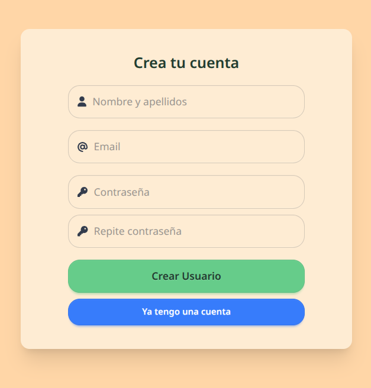
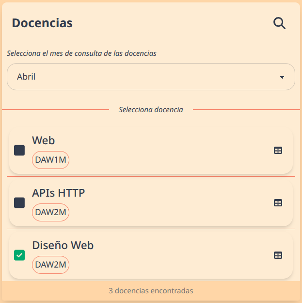
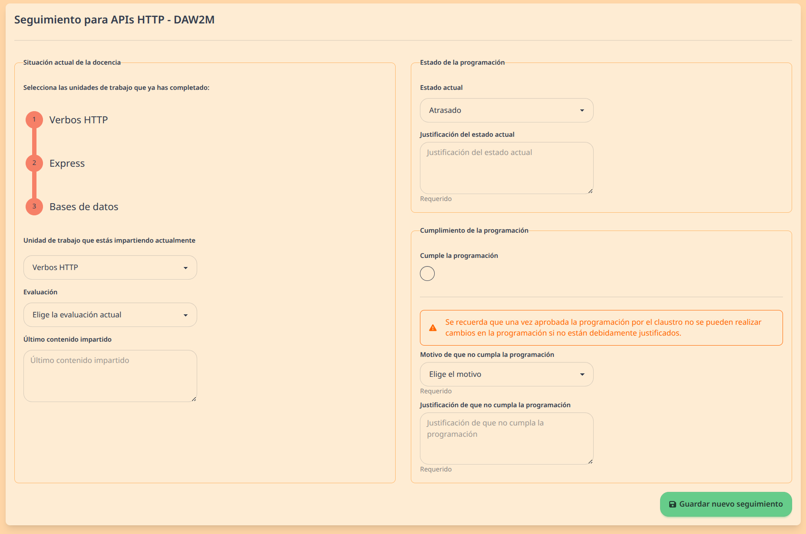

# Manual de Usuario: Sistema de Seguimiento Docente

## Introducción

Bienvenido al **Sistema de Seguimiento Docente**, una aplicación web diseñada específicamente para facilitar el seguimiento mensual de la programación didáctica de los módulos que impartes. Esta herramienta te permitirá:

- Registrar de manera eficiente el progreso de tus clases
- Documentar cualquier desviación respecto a la programación inicial
- Mantener un historial completo de tus avances por mes y evaluación

## Acceso

Deberás iniciar sesión o registrarte antes de poder hacer uso del sistema.

### Iniciar sesión

Para iniciar sesión en el sistema si ya tienes una cuentra:

1. Abre tu navegador web y acceda a la dirección del sistema proporcionada por tu institución.
2. Introduce tu email y tu contraseña.
3. Haz clic en el botón "Iniciar Sesión"

### Registrarse

Para crear una nueva cuenta en el sistema:

1. Abre tu navegador web y acceda a la dirección del sistema proporcionada por tu institución.
2. Si ya se encuentra en la página de inicio de sesión, haga clic en el botón "Registrarse".

### Formulario de Registro

En la página de registro, deberá completar el siguiente formulario:

#### Campos Obligatorios

| Campo                  | Descripción                                  | Requisitos                                                                     |
| ---------------------- | -------------------------------------------- | ------------------------------------------------------------------------------ |
| **Nombre y apellidos** | Introduce tu nombre completo                 | El sistema utilizará este nombre para identificarlo dentro de la plataforma    |
| **Email**              | Introduce tu dirección de correo electrónico | Debe ser un correo válido y activo, ya que recibirá notificaciones del sistema |
| **Contraseña**         | Cree una contraseña segura                   | Debe contener al menos 8 caracteres                                            |
| **Repite contraseña**  | Introduzca nuevamente la contraseña          | Debe coincidir exactamente con la contraseña introducida anteriormente         |

#### Consideraciones Importantes

- **Nombre completo**: Es fundamental que Introduce tu nombre y apellidos completos tal como aparecen en los registros oficiales de la institución para facilitar la identificación y asignación correcta de grupos de estudiantes.
- **Correo electrónico**: Se recomienda utiliza tu correo institucional para garantizar la recepción de todas las notificaciones relacionadas con tus grupos de estudiantes.

#### Posibles Errores

El sistema validará la información proporcionada y mostrará mensajes de error cuando:

- Algún campo obligatorio esté vacío
- El formato del correo electrónico sea incorrecto
- La contraseña tenga menos de 8 caracteres
- Las contraseñas introducidas no coincidan
- El correo electrónico ya esté registrado en el sistema

En caso de error, revisa los campos marcados y corrije la información antes de intentar registrarte nuevamente.

#### Finalización del Registro

Una vez completados correctamente todos los campos:

1. Haz clic en el botón "Crear Usuario"
2. El sistema procesará tu solicitud y, si todo es correcto, creará tu cuenta
3. Podrás iniciar sesión inmediatamente utilizando el correo y la contraseña registrados

Si ya tienes una cuenta en el sistema, puedes hacer clic en "Ya tengo una cuenta" para ir directamente a la página de inicio de sesión.

## Panel de Navegación

El sistema cuenta con un panel de navegación lateral que está siempre visible y te permite gestionar tus seguimientos.

### Elementos del Panel de Navegación:

#### 1. Selector de Mes

- En la parte superior encontrarás un selector de mes que te permite elegir el período para el que deseas consultar o crear seguimientos.
- Por defecto, se muestra el mes actual.

#### 2. Buscador de Docencias

- Puedes expandir un campo de búsqueda haciendo clic en el icono de lupa.
- Permite filtrar tus docencias por nombre del módulo o grupo.
- Para cerrar la búsqueda, haz clic en el icono X.

#### 3. Lista de Docencias

- Muestra todas tus asignaciones docentes (módulo + grupo).
- Cada docencia muestra:
  - Nombre del módulo
  - Nombre del grupo (en un recuadro redondeado)
  - Un indicador de estado:
    - ✅ Cuadrado marcado verde: Seguimiento completado para el mes seleccionado
    - ⬜ Cuadrado sin marcar: Seguimiento pendiente para el mes seleccionado
- Si no aparece ninguno, es posible que el administrador de tu sistema aún no te haya asignado ninguna docencia.

#### 4. Acciones Disponibles

- **Clic en la docencia**: Accede al formulario de seguimiento para el mes y docencia seleccionados
- **Icono de tabla**: Accede a una vista de tabla con todos los seguimientos para esa docencia

#### 5. Contador de Docencias

- En la parte inferior se muestra el total de docencias que tienes asignadas o que coinciden con tu búsqueda.

## Formulario de Seguimiento

Al seleccionar una docencia y un mes específico, accederás al formulario de seguimiento dividido en varias secciones:

### 1. Información General

En la parte superior del formulario encontrarás:

- El nombre del módulo y grupo seleccionado
- Una indicación si el seguimiento fue realizado originalmente por otro profesor (en caso de sustituciones)

### 2. Situación Actual de la Docencia

Esta sección te permite documentar el estado actual de tus clases:

#### Unidades de trabajo completadas

- Verás una lista de todas las unidades didácticas del módulo
- Marca las casillas de las unidades que ya has finalizado
- Puedes hacer clic directamente sobre el nombre de cada unidad para marcarla o desmarcarla

#### Unidad de trabajo actual

- Selecciona del desplegable la unidad que estás impartiendo actualmente
- Esta selección es obligatoria

#### Evaluación

- Indica a qué evaluación corresponde (Primera, Segunda o Tercera)
- Este campo es obligatorio

#### Último contenido impartido

- Describe brevemente el último tema o contenido trabajado con el grupo
- Si existe un seguimiento anterior, verás como referencia lo que indicaste previamente
- Este campo es obligatorio

### 3. Estado de la Programación

Aquí indicas cómo avanza la programación respecto a lo previsto:

#### Estado actual

- **Al día**: La programación se sigue según lo planeado
- **Atrasado**: Hay retraso respecto a la programación inicial
- **Adelantado**: Se ha avanzado más de lo previsto inicialmente

#### Justificación del estado actual

- Este campo aparece automáticamente si seleccionas "Atrasado" o "Adelantado"
- Debes explicar los motivos por los que existe esta desviación
- Es un campo obligatorio cuando el estado no es "Al día"

### 4. Cumplimiento de la Programación

Esta sección documenta si estás siguiendo la programación didáctica aprobada:

#### Cumple la programación

- Marca esta casilla si estás siguiendo la programación tal como fue aprobada
- Por defecto está marcada

#### Si desactivas "Cumple la programación"

Se mostrarán campos adicionales obligatorios:

##### **Motivo de incumplimiento**:

Debes seleccionar entre:

- Cambio en los Contenidos
- Cambio en la Secuenciación y distribución temporal de las UTs
- Cambio en Actividades
- Cambio en Evaluación

##### **Justificación del incumplimiento**:

Campo donde debes explicar detalladamente por qué ha sido necesario modificar la programación aprobada

### 5. Guardar el seguimiento

En la parte inferior del formulario encontrarás:

- **Guardar nuevo seguimiento**: Si es la primera vez que realizas un seguimiento para este mes.
- **Guardar cambios**: Si estás modificando un seguimiento que ya existe.

Tras enviar el formulario, un mensaje te informará si el guardado ha sido exitoso o si hay errores que debes corregir.

## Vista de Tabla de Seguimientos

Al hacer clic en el icono de tabla junto a una docencia en el panel de navegación, accederás a una vista completa de todos los seguimientos de esa asignación.

### Información General del Módulo

En la parte superior encontrarás una tarjeta con:

- **Información del Módulo**:

  - Nombre del módulo
  - Ciclo formativo al que pertenece
  - Año académico actual
  - Grupo asignado

- **Listado de Unidades de Trabajo**:
  - Todas las UTs del módulo numeradas y con sus títulos

### Tabla de Seguimientos

La tabla principal muestra cronológicamente todos los seguimientos realizados para esta docencia con las siguientes columnas:

| Columna                             | Descripción                                                                                                                                                                |
| ----------------------------------- | -------------------------------------------------------------------------------------------------------------------------------------------------------------------------- |
| **Mes**                             | Nombre del mes al que corresponde el seguimiento                                                                                                                           |
| **Estado**                          | Estado de la programación con código de colores: • **Verde**: Al día • **Rojo**: Atrasado • **Azul**: Adelantado _Incluye la justificación si está disponible_ |
| **Unidades de Trabajo completadas** | Número de UTs completadas respecto al total y listado de las mismas                                                                                                        |
| **Unidad de Trabajo actual**        | UT que se está impartiendo en ese mes                                                                                                                                      |
| **Último Contenido**                | Resumen del último contenido impartido                                                                                                                                     |
| **Cumple Programación**             | Indicador Sí/No con código de colores: • **Verde**: Sí • **Rojo**: No _Incluye el motivo y justificación si no se cumple_                                         |
| **Evaluación**                      | Indica a qué evaluación corresponde (Primera, Segunda o Tercera)                                                                                                           |
| **Examinar**                        | Botón con icono de ojo que permite acceder directamente al formulario completo de ese seguimiento                                                                          |

Esta vista te permite tener una panorámica completa de la evolución de tu docencia a lo largo del curso académico, facilitando la detección de patrones o problemas recurrentes.

## Consejos Útiles

- **Actualización mensual**: Completa los seguimientos mensualmente para mantener al día la documentación del departamento.

- **Detalle en justificaciones**: Sé específico en las justificaciones para documentar adecuadamente cualquier incidencia o cambio.

- **Revisión de histórico**: Consulta los seguimientos anteriores antes de crear uno nuevo para mantener la coherencia.

- **Planificación**: Utiliza la vista de tabla para tener una perspectiva global de todos tus seguimientos a lo largo del curso.

- **Búsqueda eficiente**: Si tienes muchas docencias asignadas, utiliza el buscador para encontrar rápidamente un módulo o grupo específico.

## Preguntas Frecuentes

**¿Puedo modificar un seguimiento después de haberlo guardado?**  
Sí, puedes acceder nuevamente al formulario del mes correspondiente y hacer los cambios necesarios.

**¿Cómo puedo ver el historial completo de seguimientos de un módulo?**  
En el panel lateral, junto a cada docencia, encontrarás un icono de tabla . Al hacer clic en él, accederás a una vista completa que muestra todos los seguimientos realizados para ese módulo y grupo a lo largo del curso académico.

**¿Cómo sé qué seguimientos tengo pendientes?**  
En el panel lateral de navegación, los seguimientos pendientes aparecen con un cuadrado sin marcar, mientras que los completados muestran un cuadrado verde marcado.

**¿Quién puede ver mis seguimientos?**  
Los seguimientos son visibles para ti, para aquellos profesores que compartan una misma docencia que tú (que imparten al mismo módulo y grupo para el que hiciste el seguimiento)

**¿Puedo realizar el seguimiento de un mes pasado?**  
Sí, el sistema permite crear seguimientos de meses anteriores si no los has completado. Simplemente selecciona el mes deseado en el selector de mes del panel de navegación.

**¿Se guarda automáticamente el borrador de mi seguimiento?**  
No, el sistema no guarda borradores automáticamente. Debes hacer clic en el botón "Guardar" para registrar tu seguimiento.
